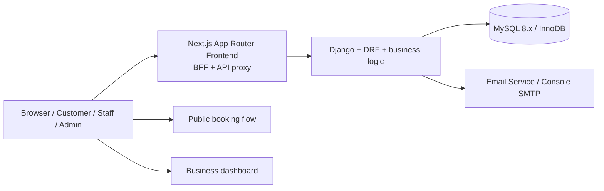
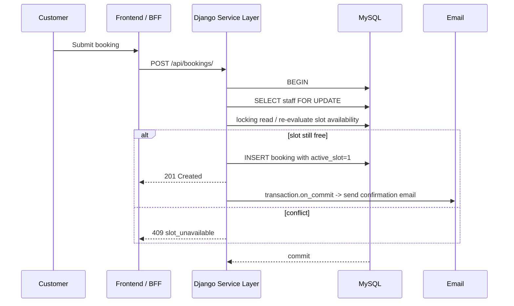

# Architecture

## System diagram

## Core booking flow

## Concurrency design notes
- The `Staff` row is locked first inside `@transaction.atomic`.
- This serialises concurrent booking attempts per staff member, preventing overlapping confirmations.
- Re-running the slot check inside the lock ensures the list of valid slots reflects fresh database state rather than a stale snapshot from an earlier read.
- `active_slot` is only set when a booking is active. When a booking is cancelled, `active_slot` becomes `NULL` and the unique index no longer blocks reuse of that slot.
- The database uniqueness constraint acts as the final defence against races that bypass the service-layer logic.
